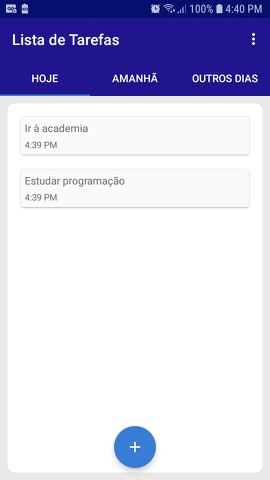
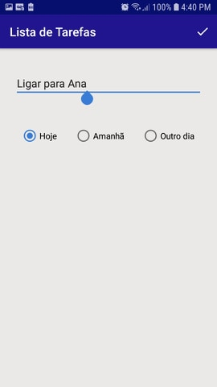

# Lista de Tarefas
Este é o meu primeiro aplicativo feito por completo. Projeto feito para colocar em prática meus conhecimentos estudados em Java e Android Studio.

# Produtividade
Dentre os meus conhecimentos praticados e aperfeiçoados na criação deste app, estão:

- Uso de abas (TabLayout)
- Manipulação de datas
- Banco de dados interno SQLite
- Uso e interação de RecyclerViews
- Etc

# Screenshots

